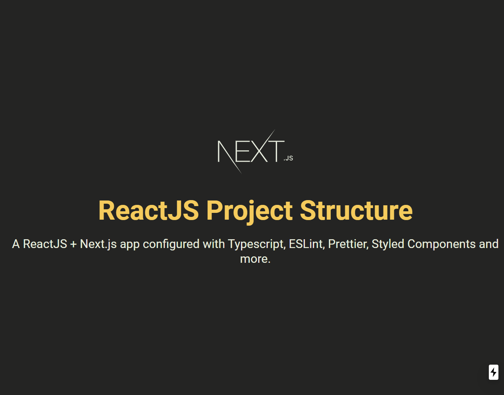

# Boilerplate | Next.js with TS

A Next.js application configured with Typescript, ESLint, Prettier, and more.

## Demo



## Get Started

Follow the steps below to properly run this application.

#### Clone the repository:

```bash
git clone https://github.com/gasscoelho/boilerplate-nextjs-typescript.git
```

```bash
cd boilerplate-nextjs-typescript
```

#### Start the application:

```bash
yarn install
```

```bash
yarn start
```

*You can also use NPM instead of YARN to install the dependencies and start the application.*

## Built With

✨ Next.js <br />
✨ TypeScript <br />
✨ ESLint <br />
✨ Prettier <br />

## Author

**[Gabriel Coelho](https://gasscoelho.me/en)** - Software Engineer
